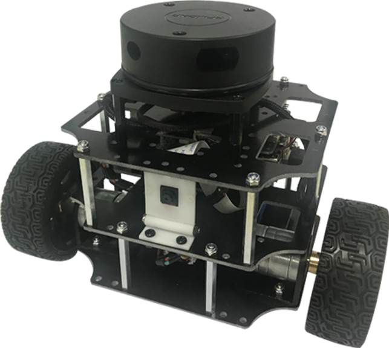
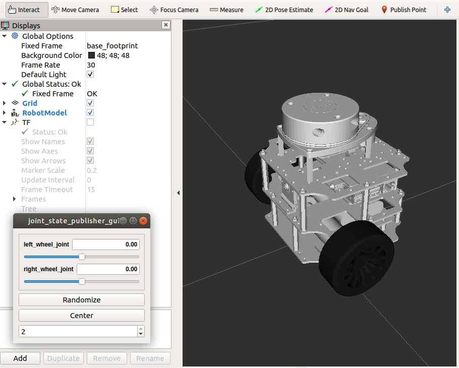
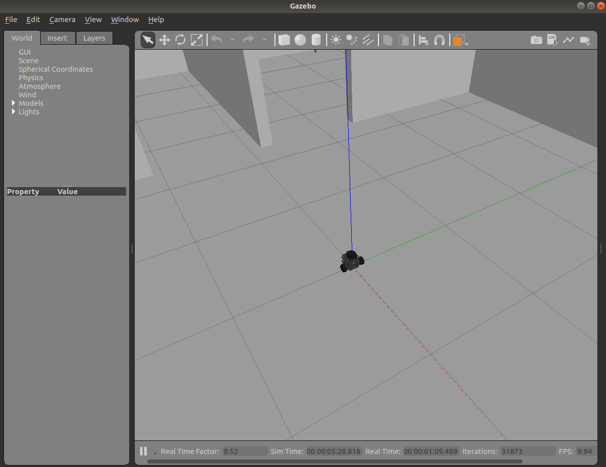
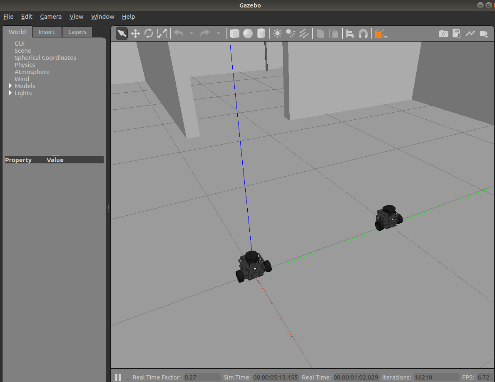

# nanorobot_description

#### 介绍
NanoRobot urdf and gazebo simulation environment

#### 使用说明

1.  display urdf in rviz
roslaunch nanorobot_description display.launch 

2.  simulation one robot in Gazebo
roslaunch nanorobot_description simulation.launch 

3.  simulation two robot in Gazebo
roslaunch nanorobot_description two_robot_simulation.launch 

